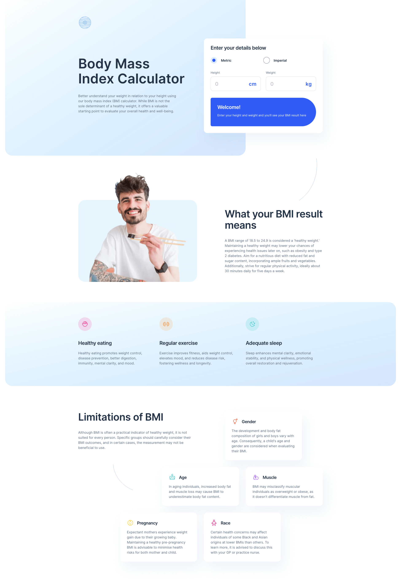

# Frontend Mentor - Body Mass Index Calculator solution

This is a solution to the [Body Mass Index Calculator challenge on Frontend Mentor](https://www.frontendmentor.io/challenges/body-mass-index-calculator-brrBkfSz1T). Frontend Mentor challenges help you improve your coding skills by building realistic projects.

## Table of contents

- [Overview](#overview)
  - [The challenge](#the-challenge)
  - [Screenshot](#screenshot)
  - [Links](#links)
- [My process](#my-process)
  - [Built with](#built-with)
  - [What I learned](#what-i-learned)
  - [Useful resources](#useful-resources)
- [Author](#author)

## Overview

### The challenge

Users should be able to:

- Select whether they want to use metric or imperial units
- Enter their height and weight
- See their BMI result, with their weight classification and healthy weight range
- View the optimal layout for the interface depending on their device's screen size
- See hover and focus states for all interactive elements on the page

### Screenshot



### Links

- Solution URL: [https://github.com/srijanss/bmi-calculator](https://github.com/srijanss/bmi-calculator)
- Live Site URL: [https://srijanss.github.io/bmi-calculator/](https://srijanss.github.io/bmi-calculator/)

## My process

### Built with

- Semantic HTML5 markup
- CSS custom properties
- Flexbox
- CSS Grid
- Mobile-first workflow
- [Vite](https://vitejs.dev/) - Lightweight frontend tooling
- [PostCSS](https://postcss.org/) - Tool to transform CSS using plugins

### What I learned

- I learned about the css to hide the spin button of input type number in different browsers

```css
& input[type="number"] {
  appearance: none;
  -webkit-appearance: none;
  -moz-appearance: textfield;

  &::-webkit-inner-spin-button,
  &::-webkit-outer-spin-button {
    -webkit-appearance: none;
    margin: 0;
  }
}
```

-- I also learned how to apply different border radius to the div element. This was the result of many hit and trials

```css
& #bmi-calculator-info {
  --circle-radius: 150px;
  border-radius: 16px var(--circle-radius) var(--circle-radius) 16px;
}
```

- I also learned about how to apply multiple linear gradients to create the background effect like the design

```css
@define-mixin bmi-app-gradient {
  background-image: linear-gradient(
    to left top,
    #d6e6fe 0%,
    #d6fcfe50 50%,
    #d6fcfe00 100%
  );
}
#curved-background {
  width: 100%;
  height: 640px;
  position: absolute;
  top: 0;
  left: 0;
  @mixin bmi-app-gradient;
  border-radius: 0 0 35px 35px;
  background-color: var(--color-white);
  z-index: -1;
}
```

### Useful resources

- [Accessibility ARIA](https://developer.mozilla.org/en-US/docs/Web/Accessibility/ARIA)
- [Weight converter](https://www.nannymcphee.co.uk/weight-conversions-from-kilograms-to-stones-and-pounds/#:~:text=There%20are%206.35kg%20in,multiple%20by%2014%20for%20pounds.)
- [Conversion of Units](https://homework.study.com/explanation/what-is-5-11-in-meters.html#:~:text=Answer%20and%20Explanation%3A,and%2011%20inches%20to%20meters.)
- [BMI calcuation](https://www.nhs.uk/health-assessment-tools/calculate-your-body-mass-index/calculate-bmi-for-adults)

## Author

- Website - [Srijan Manandhar](https://github.com/srijanss)
- Frontend Mentor - [@srijanss](https://www.frontendmentor.io/profile/srijanss)
